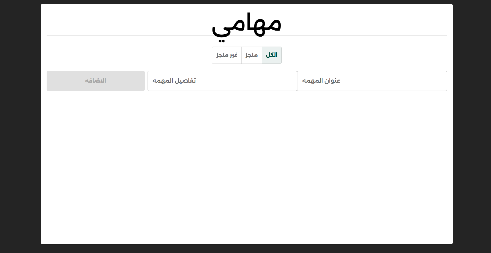

# Task Management App ✅

تطبيق متكامل لإدارة وتنظيم المهام اليومية، يساعدك في تتبع أعمالك وتحديد أولوياتك بسهولة.  
تم بناؤه باستخدام **React + Context API + Reducer** مع واجهة عصرية باستخدام **Material UI** ودعم كامل لـ **Local Storage** لحفظ البيانات.

---

## 🔗 Live Demo  
👉 https://todolistmo3.netlify.app/

## 🗂️ GitHub Repository  
👉 https://github.com/ahmed-moatemed/todolist

---

## 📸 Preview 



---

## 🚀 Features
- إضافة المهام الجديدة  
- تعديل المهام (Edit Task)  
- حذف المهام (Delete Task)  
- تحديد المهام كمكتملة  
- تصفية المهام عبر الفلاتر (All / Completed / Pending)  
- تخزين البيانات في **Local Storage** للحفاظ عليها بعد الإغلاق  
- تصميم متجاوب بالكامل لجميع الأجهزة  
- استخدام **Reducer** لإدارة منطق الحالة المعقدة  
- استخدام **Context API** لإدارة الحالة على مستوى التطبيق  
- تصميم عصري باستخدام **Material UI**

---

## 🛠️ Technologies Used
- **React.js (Vite)**  
- **Material UI (MUI)**  
- **Context API**  
- **useReducer Hook**  
- **Local Storage**  
- **JavaScript (ES6+)**  
- **Responsive CSS**  

---

## 📦 Installation & Run Locally

```bash
# Clone repository
git clone https://github.com/ahmed-moatemed/todolist.git

# Open project folder
cd todolist

# Install dependencies
npm install

# Run development server
npm run dev
```

---

## 📝 Notes
- جميع البيانات يتم حفظها في Local Storage بشكل تلقائي.  
- يمكن تطوير المشروع بإضافة:
  - نظام أولويات (High / Medium / Low)  
  - صفحة لإحصائيات المهام  
  - نظام تسجيل دخول (Authentication)  
  - مزامنة البيانات بقاعدة بيانات حقيقية (Firebase / Supabase)  
  - Dark / Light Theme  

---

## ✨ Author
Developed by **Ahmed Ibrahim Moatemed**  
📧 Email: matamedahmed@gmail.com  
🔗 Portfolio: https://mo3temed.netlify.app/
